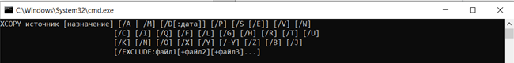

# УТИЛИТА XCOPY КОМАНДНОЙ СТРОКИ CMD

---

## Техническое задание

# СОДЕРЖАНИЕ

1. [ВВЕДЕНИЕ](#1)  
   1.1. [Наименование](#1.1)  
   1.2. [Краткая характеристика области применения](#1.2)
2. [ОСНОВАНИЯ ДЛЯ РАЗРАБОТКИ](#2)  
   2.1. [Основания для проведения разработки](#2.1)  
   2.2. [Наименование и условное обозначение темы разработки](#2.2)
3. [НАЗНАЧЕНИЕ РАЗРАБОТКИ](#3)  
   3.1. [Функциональное назначение](#3.1)  
   3.2. [Эксплуатационное назначение](#3.2)
4. [ТРЕБОВАНИЯ К ПРОГРАММЕ](#4)  
   4.1. [Требования к функциональным характеристикам](#4.1)  
   4.1.1. [Требования к составу выполняемых функций](#4.1.1)  
   4.1.2. [Требования к организации входных и выходных данных](#4.1.2)  
   4.1.3. [Требования к временным характеристикам](#4.1.3)  
   4.2. [Требования к надежности](#4.2)  
   4.2.1. [Требования к обеспечению устойчивого функционирования](#4.2.1)  
   4.2.2. [Контроль входной и выходной информации](#4.2.2)  
   4.2.3. [Время восстановления после отказа](#4.2.3)  
   4.3. [Условия эксплуатации](#4.3)  
   4.3.1. [Климатические условия эксплуатации](#4.3.1)  
   4.3.2. [Требования к видам обслуживания](#4.3.2)  
   4.3.3. [Требования к численности и квалификации персонала](#4.3.3)  
   4.4. [Требования к составу и параметрам технических средств](#4.4)  
   4.5. [Требования к информационной и программной совместимости](#4.5)  
   4.5.1. [Требования к информационным структурам и методам решения](#4.5.1)  
   4.5.2. [Требования к исходным кодам и языкам программирования](#4.5.2)  
   4.5.3. [Требования к программным средствам, используемых программой](#4.5.3)  
   4.5.4. [Требования к защите информации и программ](#4.5.4)  
   4.6. [Требования к маркировке и упаковке](#4.6)  
   4.7. [Требования к транспортированию и хранению](#4.7)  
   4.8. [Специальные требования](#4.8)
5. [ТРЕБОВАНИЯ К ПРОГРАММНОЙ ДОКУМЕНТАЦИИ](#5)  
   5.1. [Предварительный состав программной документации](#5.1)  
   5.2. [Специальные требования к программной документации](#5.2)
6. [ТЕХНИКО-ЭКОНОМИЧЕСКИЕ ПОКАЗАТЕЛИ](#6)  
   6.1. [Ориентировочная экономическая эффективность](#6.1)  
   6.2. [Предполагаемая годовая потребность](#6.2)  
   6.3. [Экономические преимущества разработки](#6.3)
7. [СТАДИИ И ЭТАПЫ РАЗРАБОТКИ](#7)  
   7.1. [Стадии разработки](#7.1)  
   7.2. [Этапы разработки](#7.2)  
   7.3. [Содержание работ по этапам](#7.3)
8. [ПОРЯДОК КОНТРОЛЯ И ПРИЕМКИ](#8)  
   8.1. [Виды испытаний](#8.1)  
   8.2. [Общие требования к приемке работы](#8.2)

# <a name = "1" > 1. ВВЕДЕНИЕ </a>

---

## <a name = "1.1" > 1.1. Наименование </a>

---

Наименование – «Утилита XCOPY командной строки CMD».

## <a name = "1.2" > 1.2. Краткая характеристика области применения </a>

---

Утилита XCOPY используется для копирования файлов и каталогов с сохранением их структуры. По сравнению с командой COPY имеет более широкие возможности и является наиболее гибким средством копирования в командной строке.

# <a name = "2" > 2. ОСНОВАНИЯ ДЛЯ РАЗРАБОТКИ </a>

---

## <a name = "2.1" > 2.1. Основания для проведения разработки </a>

---

Основания для проведения разработки является лабораторная работа №2 по дисциплине ТРПО. Лабораторная работа утверждена Сувальским А. А., в дальнейшем именуемым Заказчиком. Дата утверждения – 11.09.20.

## <a name = "2.2" > 2.2. Наименование и условное обозначение темы разработки </a>

---

Наименование темы разработки – «Разработка утилиты XCOPY».  
Условное обозначение темы разработки – «А.В.00001».

# <a name = "3" > 3. НАЗНАЧЕНИЕ РАЗРАБОТКИ </a>

---

## <a name = "3.1" > 3.1. Функциональное назначение </a>

---

Функциональным назначением утилиты является копирование файлов и каталогов с сохранением их структуры.

## <a name = "3.2" > 3.2. Эксплуатационное назначение </a>

---

Утилита XCOPY должна эксплуатироваться в интерпретаторе командной строки CMD или в пакетном файле.

# <a name = "4" > 4. ТРЕБОВАНИЯ К ПРОГРАММЕ </a>

---

## <a name = "4.1" > 4.1. Требования к функциональным характеристикам </a>

---

### <a name = "4.1.1" > 4.1.1. Требования к составу выполняемых функций </a>

---

Утилита XCOPY должна обеспечивать возможность выполнения следующих функций:

1. функция копирования файлов, каталогов и подкаталогов;
2. функция вывода имен исходных данных и файлов-результатов;
3. функция отображения списка копируемых файлов.

## <a name = "4.1.2" > 4.1.2. Требования к организации входных и выходных данных </a>

---

4.1.2.1. Утилита XCOPY должна иметь синтаксис, изображенный на рис.1.

Рис. 1 – Общий синтаксис команды XCOPY

4.1.2.2. Параметры командной строки.

1. _/A_ Копирует только файлы с установленным атрибутом архивации;  
   a. сам атрибут при этом не изменяется.
2. _/M_ Копирует только файлы с установленным атрибутом архивации;  
   a. после копирования атрибут снимается.
3. _/D:м-д-г_ Копирует файлы, измененные не ранее указанной даты.  
   a. Если дата не указана, заменяются только конечные файлы.  
   b. с более ранней датой, чем у исходных файлов.
4. _/EXCLUDE:файл1[+файл2][+файл3]..._  
   a. Список файлов, содержащих строки. Каждая строка должна располагаться в отдельной строке в файлах. Если какая-либо из строк совпадает с любой частью абсолютного пути к копируемому файлу, такой файл исключается из операции копирования. Например, при указании строки \obj\ или .obj будут исключены все файлы из каталога obj или все файлы с расширением OBJ соответственно.
5. _/P_ Выводит запросы перед созданием каждого конечного файла.
6. _/S_ Копирует только непустые каталоги с подкаталогами.
7. _/E_ Копирует каталоги с подкаталогами, включая пустые.  
   Эквивалент сочетания параметров /S /E. Совместим с параметром /T.
8. _/V_ Проверяет размер каждого нового файла.
9. _/W_ Выводит запрос на нажатие клавиши перед копированием.
10. _/C_ Продолжает копирование вне зависимости от наличия ошибок.
11. _/I_ Если назначение не существует и копируется несколько файлов, считается, что местом назначения является каталог.
12. _/Q_ Запрещает вывод имен копируемых файлов.
13. _/F_ Выводит полные имена исходных и конечных файлов во время копирования.
14. _/L_ Выводит копируемые файлы.
15. _/G_ Копирует зашифрованные файлы в конечную папку, не поддерживающую шифрование.
16. _/H_ Копирует скрытые и системные файлы (среди прочих).
17. _/R_ Разрешает замену файлов, предназначенных только для чтения.
18. _/T_ Создает структуру каталогов (кроме пустых каталогов) без копирования файлов. Для создания пустых каталогов и подкаталогов используйте сочетание параметров /T /E.
19. _/U_ Копирует только файлы, уже имеющиеся в конечной папке.
20. _/K_ Копирует атрибуты. При использовании команды XСOPY обычно сбрасываются атрибуты "только для чтения".
21. _/N_ Использует короткие имена при копировании.
22. _/O_ Копирует сведения о владельце и данные ACL.
23. _/X_ Копирует параметры аудита файлов (требуется параметр /O).
24. _/Y_ Подавляет запрос на подтверждение перезаписи существующего конечного файла.
25. _/-Y_ Обязательный запрос на подтверждение перезаписи существующего конечного файла.
26. _/Z_ Копирует сетевые файлы с возобновлением.
27. _/B_ Копирует символьную ссылку вместо ее целевого объекта.
28. _/J_ Копирует с использованием ввода-вывода без буферизации. Рекомендуется для очень больших файлов.

Параметр _/Y_ можно установить заранее через переменную среды COPYCMD.  
Параметр _/-Y_ командной строки переопределяет такую установку.

4.1.2.3. Особенности утилиты XCOPY

• **Использование /z**
Если вы потеряли подключение на этапе копирования (например, если сервер переходит в режим «вне сети»), то после повторного подключения Подключение возобновится. /z также отображает процент выполнения операции копирования для каждого файла.  
• **Копирование зашифрованных файлов**  
Копирование зашифрованных файлов на том, который не поддерживает EFS, приводит к ошибке. Сначала расшифровать файлы или скопировать их на том, который поддерживает EFS.  
• **Добавление файлов**  
Чтобы добавить файлы, укажите один файл для назначения, но несколько файлов для источника (то есть с помощью подстановочных знаков или формата file1 + file2 + файл3).  
• **Значение по умолчанию для назначения**  
Если опустить назначение, команда XCOPY скопирует файлы в текущий каталог.  
• **Использование команды XCOPY для установки атрибута архива для целевых файлов**  
Команда XCOPY создает файлы с установленным атрибутом Archive, независимо от того, был ли этот атрибут задан в исходном файле.  
• **Сравнение XCOPY и DISKCOPY**  
Если у вас есть диск, содержащий файлы в подкаталогах, и вы хотите скопировать его на диск, имеющий другой формат, используйте команду XCOPY вместо команды DISKCOPY. Так как команда DISKCOPY копирует диски по дорожке, исходный и целевой диски должны иметь одинаковый формат. Команда XCOPY не имеет этого требования. Используйте XCOPY, если вам не нужна полная копия образа диска.

Коды выхода для команды XCOPY:  
0 – Файлы были скопированы без ошибок.  
1 – Не найдены файлы для копирования.  
2 – Пользователь нажал клавиши CTRL + C для завершения команды XCOPY.  
4 – Произошла ошибка инициализации. Недостаточно памяти или места на диске, либо в командной строке введено недопустимое имя диска или недопустимый синтаксис.  
5 – Произошла ошибка записи на диск.

### <a name = "4.1.3" > 4.1.3. Требования к временным характеристикам </a>

---

Требования к временным характеристикам программы не предъявляются.

## <a name = "4.2" > 4.2. Требования к надежности </a>

---

### <a name = "4.2.1" > 4.2.1. Требования к обеспечению устойчивого функционирования </a>

---

Надежность (устойчивое) функционирование программы должно быть обеспечено выполнением совокупности организационно-технических мероприятий:

1. организацией бесперебойного питания технических средств;
2. выполнением рекомендаций Министерства труда и социального развития РФ, изложенных в Постановлении от 23 июля 1998 г. «Об утверждении межотраслевых типовых норм времени на работы по сервисному обслуживанию ПЭВМ и оргтехники и сопровождению программных средств»;
3. выполнение требований ГОСТ 51188-98. Защита информации. Испытания программных средств на наличие компьютерных вирусов;
4. необходимым уровнем квалификации сотрудников профильных подразделений.

### <a name = "4.2.2" > 4.2.2. Контроль входной и выходной информации </a>

---

В случае неправильного ввода команды XCOPY, командная строка должна вывести сообщение, показанное на рис. 2.

Рис. 2 – Неправильный ввод команды XCOPY

### <a name = "4.2.3" > 4.2.3. Время восстановления после отказа </a>

---

Время восстановления после отказа должно не превышать 30 минут.

## <a name = "4.3" > 4.3. Условия эксплуатации </a>

---

## <a name = "4.3.1" > 4.3.1. Климатические условия эксплуатации </a>

---

Программа должна работать в закрытых помещениях, при нормальных климатических условиях.  
Температура окружающего воздуха должна быть в диапазоне 20-25 градусов, относительная влажность на уровне 40-60%.

### <a name = "4.3.2" > 4.3.2. Требования к видам обслуживания </a>

---

Проводится периодическое тестирование программы, раз в полгода.

### <a name = "4.3.3" > 4.3.3. Требования к численности и квалификации персонала </a>

---

Минимальное количество персонала, требуемого для работы программы, должно составлять не менее двух штатных единиц – системный программист и конечный пользователь программы – оператор.  
Системный программист должен иметь минимум среднее техническое образование. В перечень задач, выполняемых системным программистом, должны входить:

1. задача поддержания работоспособности технических средств;
2. задача установки (инсталляции) и поддержания работоспособности системного программного средства – операционной системой;
3. задача установки (инсталляции) программы.

Конечный пользователь программы (оператор) должен обладать практическими навыками работы с графическим пользовательским интерфейсом оперативной системы.

## <a name = "4.4" > 4.4. Требования к составу и параметрам технических средств </a>

---

В состав технических средств должен входить IBM-совместимый персональный компьютер (ПЭВМ), включающий в себя:

1. процессор Pentium – 4 с тактовой частотой не менее 300 МГц;
2. оперативная память объемом не менее 128 Мб;
3. жесткий диск объемом 1.5 Гб и выше.

## <a name = "4.5" > 4.5. Требования к информационной и программной совместимости </a>

---

### <a name = "4.5.1" > 4.5.1. Требования к информационным структурам и методам решения </a>

---

Требования к информационным структурам на входе и выходе, а также к методам решения не предъявляются.

### <a name = "4.5.2" > 4.5.2. Требования к исходным кодам и языкам программирования </a>

---

Исходные коды программы должны быть реализованы в пакетном файле или непосредственно в интерпретаторе командной строки CMD.

### <a name = "4.5.3" > 4.5.3. Требования к программным средствам, используемых программой </a>

---

Должна использоваться командная строка, встроенная в операционную систему Windows XP.

### <a name = "4.5.4" > 4.5.4. Требования к защите информации и программы </a>

---

Требования к защите информации и программ не предъявляются.

## <a name = "4.6" > 4.6. Требования к маркировке и упаковке </a>

---

Требования к маркировке и упаковке не предъявляются.

## <a name = "4.7" > 4.7. Требования к транспортированию и хранению </a>

---

Требования к транспортированию и хранению не предъявляются.

## <a name = "4.8" > 4.8. Специальные требования </a>

---

Специальные требования к программе не предъявляются.

# <a name = "5" > 5. ТРЕБОВАНИЯ К ПРОГРАММНОЙ ДОКУМЕНТАЦИИ </a>

---

## <a name = "5.1" > 5.1. Предварительный состав программной документации </a>

---

Состав программной документации должен включать в себя:

1. техническое задание;
2. спецификация;
3. текст программы;
4. описание программы;
5. программу и методики испытаний;
6. пояснительную записку;
7. ведомость эксплуатационных документов;
8. формуляр;
9. описание применения;
10. руководство системного программиста;
11. руководство программиста;
12. руководство оператора.

## <a name = "5.2" > 5.2. Специальные требования к программной документации </a>

---

Специальные требования к программной документации не предъявляются.

# <a name = "6" > 6. ТЕХНИКО-ЭКОНОМИЧЕСКИЕ ПОКАЗАТЕЛИ </a>

---

## <a name = "6.1" > 6.1. Ориентировочная экономическая эффективность </a>

---

Ориентировочная экономическая эффективность не рассчитывается.

## <a name = "6.2" > 6.2. Предполагаемая годовая потребность </a>

---

Предполагаемая годовая потребность не рассчитывается.

## <a name = "6.3" > 6.3. Экономические преимущества разработки </a>

---

Экономические преимущества разработки не рассчитываются.

# <a name = "7" > 7. СТАДИИ И ЭТАПЫ РАЗРАБОТКИ </a>

---

## <a name = "7.1" > 7.1. Стадии разработки </a>

---

Разработка должна быть проведена в три стадии:

1. разработка технического задания;
2. рабочее проектирование;
3. внедрение.

## <a name = "7.2" > 7.2. Этапы разработки </a>

---

На стадии разработки технического задания должен быть выполнен этап разработки, согласования и утверждения между Заказчиком и Исполнителем настоящего технического задания.

На стадии рабочего проектирования должны быть выполнены следующие этапы работы:

1. разработка программы;
2. разработка программной документации;
3. испытания программы.  
   На стадии внедрения должен быть выполнен этап разработка – подготовка и передача программы.

## <a name = "7.3" > 7.3. Содержание работ по этапам </a>

---

На этапе разработки технического задания должны быть выполнены следующие виды работ:

1. постановка задачи;
2. определение и уточнение требований к техническим средствам;
3. определение требований к программе;
4. определение стадий, этапов и сроков разработки программы и документации на нее;
5. выбор языков программирования;
6. согласование и утверждение технического задания.

На этапе разработки программной документации должна быть выполнена разработка программных документов в соответствии с требованиями ГОСТ 19.101-77 и требованием п. «Предварительный состав программный документации» настоящего технического задания.

На этапе испытаний программы должны быть выполнены следующие виды работ:

1. разработка, согласование и утверждение программы и методики испытаний;
2. ведение приемо-сдаточных испытаний;
3. корректировка программы и программной документации по результатам испытаний.

На этапе подготовки и передачи программы должна быть выполнена работа по подготовке и передаче программы и программной документации в эксплуатацию на объектах Заказчика.

# <a name = "8" > 8. ПОРЯДОК КОНТРОЛЯ И ПРИЕМКЕ </a>

---

## <a name = "8.1" > 8.1. Виды испытаний </a>

---

Приемо-сдаточные испытания программы должны проводиться согласно разработанной Исполнителем и согласованной Заказчиком «Программы и методики испытаний».  
Ход проведения приемо-сдаточных испытаний Заказчик и Исполнитель документируют в Протоколе проведения испытаний.

## <a name = "8.2" > 8.2. Общие требования к приемке работы </a>

---

После проведения испытаний в полном объеме, на основании «Протокола испытаний» утверждают «Свидетельство о приемке» и производят запись в программном документе «Формуляр»
